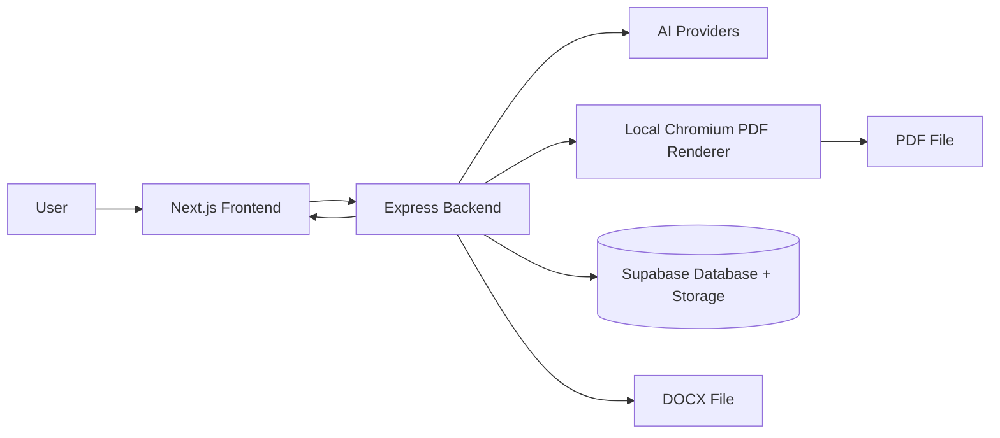
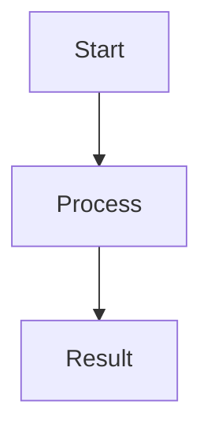

# Bookgen.ai

Bookgen.ai is a full-stack AI document generator for producing structured books and research papers as downloadable **PDF** or **DOCX** files. The project combines a Next.js frontend, a Node/Express backend, AI generation providers, local Chromium PDF rendering, and Supabase document storage.

> **Important quality note:** AI-generated content can contain mistakes, outdated facts, or invented references. The backend prompts and rendering pipeline are designed to reduce repetition and hallucination, but generated documents should still be reviewed before publishing or sharing professionally.

---

## Table of Contents

1. [What This Project Does](#what-this-project-does)
2. [Architecture](#architecture)
3. [Features](#features)
4. [Tech Stack](#tech-stack)
5. [Repository Structure](#repository-structure)
6. [Prerequisites](#prerequisites)
7. [Environment Variables](#environment-variables)
8. [Local Setup](#local-setup)
9. [Running the App](#running-the-app)
10. [API Reference](#api-reference)
11. [Document Generation Pipeline](#document-generation-pipeline)
12. [PDF Quality and Math Rendering](#pdf-quality-and-math-rendering)
13. [Diagrams](#diagrams)
14. [Supabase Setup](#supabase-setup)
15. [Firebase Setup](#firebase-setup)
16. [Production Checklist](#production-checklist)
17. [Troubleshooting](#troubleshooting)
18. [Development Notes](#development-notes)

---

## What This Project Does

Bookgen.ai lets a user enter a topic and generate a complete document. The backend creates a table of contents, generates chapters, combines the content, renders diagrams, converts Markdown/HTML into a professional PDF, optionally creates DOCX, stores metadata, and returns the file to the user.

Supported generation types:

| Type | Endpoint | Purpose |
| --- | --- | --- |
| Small book | `POST /api/generateBookSmall` | Shorter educational book |
| Medium book | `POST /api/generateBookMed` | More comprehensive book with exercises/projects |
| Long book | `POST /api/generateBookLong` | Longer structured book |
| Research paper | `POST /api/generateResearchPaper` | Research-style document |
| Long research paper | `POST /api/generateResearchPaperLong` | Extended research-style document |

---

## Architecture



Main backend flow:

1. Validate the request body.
2. Create a document row in Supabase if Supabase is configured.
3. Generate a coherent table of contents.
4. Generate chapters against the global book plan to reduce duplicate ideas.
5. Normalize math syntax and Markdown.
6. Render Mermaid diagrams through Kroki when diagrams are present.
7. Render the final HTML to PDF with local Chromium/Puppeteer.
8. Upload the file to Supabase Storage when configured.
9. Return the generated file to the client.

---

## Features

### Document Generation

- AI-generated books and research papers.
- Structured table of contents with subtopics.
- Chapter prompts include continuity rules to reduce repetition across chapters.
- Prompts instruct the model not to fabricate citations, quotes, URLs, statistics, or source names.
- Supports PDF and DOCX response formats.

### PDF Rendering

- Local Chromium/Puppeteer rendering instead of a paid external PDF provider.
- A4 PDF output.
- Print backgrounds enabled.
- Headers and page-number footers.
- MathJax support for LaTeX-style symbols and equations.
- Prism/highlight.js support for code blocks.
- Mermaid diagram rendering through Kroki.
- Figure captions for generated diagrams.

### Document Management

- Supabase document metadata.
- Supabase file uploads.
- User document history.
- Delete document endpoint.
- Share-link endpoint.

### Frontend

- Next.js 15 app.
- Firebase authentication.
- Supabase client integration.
- Dashboard, documents, login, and share pages.

---

## Tech Stack

### Frontend

- Next.js
- TypeScript
- React
- HeroUI
- Tailwind CSS
- Firebase Auth
- Supabase client
- Axios

### Backend

- Node.js 20+
- Express
- Cerebras SDK for small/medium book generation
- Gemini SDK for long book generation
- Together AI SDK for research paper generation
- Puppeteer Core
- `@sparticuz/chromium`
- Marked
- Highlight.js
- MathJax in rendered HTML
- Kroki for Mermaid-to-SVG diagrams
- DOCX generation
- Supabase database and storage
- Winston logging

---

## Repository Structure

```text
projectx/
├── backend/
│   ├── AI/
│   │   ├── SB.js                 # Small book generator
│   │   ├── MB.js                 # Medium book generator
│   │   └── LB.js                 # Long book generator
│   ├── controllers/
│   │   └── documentController.js # Generation/document endpoints
│   ├── routes/
│   │   └── api.js                # API routes
│   ├── test/
│   │   ├── RS.js                 # Research paper generator
│   │   └── RL.js                 # Long research paper generator
│   ├── utils/
│   │   ├── documentQuality.js    # Prompt, TOC, and math helpers
│   │   ├── docxGenerator.js      # DOCX export helper
│   │   ├── pdfRenderer.js        # Local Chromium PDF renderer
│   │   └── supabaseClient.js     # Supabase integration
│   ├── .env.example
│   ├── package.json
│   └── server.js
├── frontend/
│   ├── app/
│   ├── components/
│   ├── auth/
│   ├── lib/
│   ├── .env.local.example
│   └── package.json
└── README.md
```

---

## Prerequisites

Install these before running locally:

- Node.js 20 or newer.
- npm.
- A Cerebras API key for small and medium book generation.
- A Gemini API key for long book generation.
- Supabase project if you want document history/storage.
- Firebase project if you want full frontend authentication.

For Linux/VPS deployments, installing system Chromium is recommended:

```bash
sudo apt-get update
sudo apt-get install -y chromium fonts-liberation fonts-dejavu-core
```

Then set:

```bash
CHROME_EXECUTABLE_PATH=/usr/bin/chromium
```

If `CHROME_EXECUTABLE_PATH` is not set, the backend falls back to `@sparticuz/chromium`.

---

## Environment Variables

### Backend

Copy the example file:

```bash
cp backend/.env.example backend/.env
```

Required/optional values:

| Variable | Required | Description |
| --- | --- | --- |
| `PORT` | No | Backend port. Defaults to `5000`. |
| `NODE_ENV` | No | `development` or `production`. |
| `CEREBRAS_API_KEY` | Yes for small/medium books | API key used by `SB.js` and `MB.js`. |
| `GEMINI_API_KEY` | Yes for long books | API key used by `LB.js`. |
| `TOGETHER_API_KEY` | Yes for research papers | API key used by `RS.js` and `RL.js`. |
| `SUPABASE_URL` | Optional | Supabase project URL. Required for document history/storage. |
| `SUPABASE_SERVICE_ROLE_KEY` | Optional | Supabase service role key. Keep this server-side only. |
| `SUPABASE_BUCKET` | Optional | Storage bucket name. Current code uses `documents`. |
| `CHROME_EXECUTABLE_PATH` | Optional | Path to system Chromium/Chrome. |

### Frontend

Copy the example file:

```bash
cp frontend/.env.local.example frontend/.env.local
```

| Variable | Required | Description |
| --- | --- | --- |
| `NEXT_PUBLIC_SUPABASE_URL` | Yes | Supabase project URL for the browser client. |
| `NEXT_PUBLIC_SUPABASE_ANON_KEY` | Yes | Supabase anon key for the browser client. |
| `NEXT_PUBLIC_API_URL` | Yes | Backend URL, for example `http://localhost:5000`. |

---

## Local Setup

### 1. Install backend dependencies

```bash
cd backend
npm install
```

### 2. Install frontend dependencies

```bash
cd ../frontend
npm install
```

### 3. Configure backend environment

```bash
cd ../backend
cp .env.example .env
```

Edit `backend/.env` and add your API keys.

### 4. Configure frontend environment

```bash
cd ../frontend
cp .env.local.example .env.local
```

Edit `frontend/.env.local` and point `NEXT_PUBLIC_API_URL` to the backend.

---

## Running the App

### Backend

```bash
cd backend
npm start
```

The backend runs at:

```text
http://localhost:5000
```

Health checks:

```text
GET http://localhost:5000/health
GET http://localhost:5000/api/health
```

### Frontend

```bash
cd frontend
npm run dev
```

The frontend runs at:

```text
http://localhost:3000
```

---

## API Reference

### Generate a small book

```http
POST /api/generateBookSmall
Content-Type: application/json
```

```json
{
  "prompt": "Introduction to machine learning",
  "userId": "firebase-user-id",
  "format": "pdf"
}
```

### Generate a medium book

```http
POST /api/generateBookMed
Content-Type: application/json
```

```json
{
  "prompt": "Practical web security",
  "userId": "firebase-user-id",
  "format": "pdf"
}
```

### Generate a long book

```http
POST /api/generateBookLong
Content-Type: application/json
```

```json
{
  "prompt": "Distributed systems",
  "userId": "firebase-user-id",
  "format": "docx"
}
```

### Generate a research paper

```http
POST /api/generateResearchPaper
Content-Type: application/json
```

```json
{
  "prompt": "The effect of retrieval augmented generation on education",
  "userId": "firebase-user-id",
  "format": "pdf"
}
```

### Document history

```http
GET /api/documents/:userId
DELETE /api/documents/:documentId
POST /api/documents/:documentId/share
GET /api/share/:token
```

### Cancel generation

```http
POST /api/cancelGeneration
Content-Type: application/json
```

```json
{
  "userId": "firebase-user-id"
}
```

---

## Document Generation Pipeline

### Table of contents

The active book generators now use shared prompt helpers from `backend/utils/documentQuality.js` to create a professional TOC. The TOC prompt requires:

- Exact chapter count.
- Unique chapter purpose.
- 4-6 subtopics per chapter.
- Progressive ordering.
- No duplicate ideas.
- No fake citations in the table of contents.

### Chapter continuity

Each chapter prompt receives the whole book plan plus nearby previous/upcoming chapters. This helps the AI keep chapters connected and avoid repeating the same explanation.

### Hallucination control

The prompts instruct the AI to:

- Qualify uncertain or date-sensitive facts.
- Avoid fabricated citations, statistics, quotes, URLs, and source names.
- Use only credible resources it is confident exist.
- Prefer general resource categories when exact sources are uncertain.

This improves quality, but it cannot mathematically guarantee truth. Human review is still required for production/publication.

---

## PDF Quality and Math Rendering

PDFs are rendered locally by `backend/utils/pdfRenderer.js` with Puppeteer and Chromium.

The renderer:

- Cleans accidental whitespace in asset URLs.
- Uses an A4 print viewport.
- Emulates print media.
- Waits for page load and network idle.
- Waits for web fonts.
- Runs MathJax typesetting when available.
- Runs Prism highlighting when available.
- Writes the PDF with print backgrounds, margins, headers, and footers.
- Rejects empty/invalid output files.

Math guidance for generated content:

| Use case | Syntax |
| --- | --- |
| Inline math | `$E = mc^2$` |
| Display math | `$$\sum_{i=1}^{n} i = \frac{n(n+1)}{2}$$` |
| Greek symbols | `\alpha`, `\beta`, `\theta` |
| Relations | `\leq`, `\geq`, `\in`, `\subseteq` |
| Logic | `\wedge`, `\vee`, `\rightarrow` |

The shared document quality helper preserves LaTeX commands instead of replacing mathematical symbols with plain text approximations.

---

## Diagrams

The generators can ask the AI to include Mermaid diagrams when they help the explanation. Diagram blocks must use this format:

````markdown

*Figure caption: A short explanation of the diagram*
````

The backend sends Mermaid code to Kroki and embeds the returned SVG as a base64 image in the PDF. If a diagram fails to render, the generator removes the broken diagram block instead of failing the whole document.

---

## Supabase Setup

Create a Supabase project and configure:

### Table: `documents`

Recommended columns:

| Column | Type | Notes |
| --- | --- | --- |
| `id` | `uuid` | Primary key. |
| `user_id` | `text` or `uuid` | Must match your auth/user ID strategy. |
| `title` | `text` | Original prompt/topic. |
| `type` | `text` | `book_small`, `book_medium`, `book_long`, etc. |
| `format` | `text` | `pdf` or `docx`. |
| `file_url` | `text` | Public file URL. |
| `file_size` | `bigint` | File size in bytes. |
| `share_token` | `text` | Public share token. |
| `is_public` | `boolean` | Whether sharing is enabled. |
| `generation_status` | `text` | `processing`, `completed`, or `failed`. |
| `created_at` | `timestamptz` | Default `now()`. |
| `updated_at` | `timestamptz` | Optional update timestamp. |

### Storage bucket

Create a public bucket named:

```text
documents
```

If you use a private bucket instead, update the backend to generate signed URLs rather than public URLs.

---

## Firebase Setup

The frontend uses Firebase Authentication. Configure Firebase in `frontend/auth/firebaseSDK.ts`.

Required Firebase steps:

1. Create a Firebase project.
2. Enable Authentication.
3. Enable Email/Password and Google sign-in providers.
4. Add your local and production domains to Firebase authorized domains.
5. Copy the Firebase web app config into the frontend.

---

## Production Checklist

Before giving the project to other people or deploying publicly:

- [ ] Remove all real secrets from git history and rotate any exposed API keys.
- [ ] Set `CEREBRAS_API_KEY` and `GEMINI_API_KEY` through environment variables only.
- [ ] Configure Supabase service role key only on the backend.
- [ ] Confirm the backend can run Chromium in the host environment.
- [ ] Set `CHROME_EXECUTABLE_PATH` if using system Chromium.
- [ ] Test small, medium, and long document generation.
- [ ] Test math-heavy prompts.
- [ ] Test Mermaid-heavy prompts.
- [ ] Test DOCX output.
- [ ] Test cancel generation.
- [ ] Add rate limiting/auth checks before exposing the backend broadly.
- [ ] Review generated content before sharing professionally.

---

## Troubleshooting

### PDF generation fails with Chromium errors

Try installing system Chromium and setting `CHROME_EXECUTABLE_PATH`:

```bash
sudo apt-get update
sudo apt-get install -y chromium fonts-liberation fonts-dejavu-core
export CHROME_EXECUTABLE_PATH=/usr/bin/chromium
```

### Math symbols do not render

Check that the generated content uses proper LaTeX syntax:

```text
Inline: $\alpha + \beta$
Display: $$\int_0^1 x^2 dx$$
```

Also confirm the backend has network access to the MathJax CDN used inside the generated HTML.

### Diagrams disappear

Mermaid diagrams are rendered by Kroki. If the Mermaid syntax is invalid or Kroki is unreachable, the backend removes the broken diagram block. Ask the model to use simpler Mermaid syntax and quoted labels.

### Supabase upload fails

Check:

- `SUPABASE_URL`
- `SUPABASE_SERVICE_ROLE_KEY`
- Bucket name `documents`
- Bucket public/private policy
- File size limits

### Generated chapters repeat ideas

The prompts include continuity context, but AI output can still repeat. Improvements you can add later:

- Store chapter summaries after each chapter.
- Feed previous chapter summaries into the next prompt.
- Run a post-generation critique pass.
- Add citation retrieval/RAG for factual grounding.

---

## Development Notes

Useful checks:

```bash
node --check backend/server.js backend/routes/api.js backend/AI/SB.js backend/AI/MB.js backend/AI/LB.js backend/utils/documentQuality.js backend/utils/pdfRenderer.js
```

PDF renderer smoke test:

```bash
cd projectx
node --input-type=module - <<'NODE'
import { renderHtmlToPdf } from './backend/utils/pdfRenderer.js';
import fs from 'fs';
const output = '/tmp/bookgen-pdf-renderer-smoke.pdf';
await renderHtmlToPdf('<!doctype html><html><body><h1>Bookgen smoke test</h1><p>$E = mc^2$</p></body></html>', output, { displayHeaderFooter: false });
console.log(fs.statSync(output).size);
NODE
```

Backend dependency cleanup:

- The active book PDF pipeline uses local Chromium rendering.
- The backend no longer needs a paid PDF provider for book PDFs.
- Keep dependency changes synchronized with `backend/package-lock.json`.

---

## License

This project currently uses the license declared in each package file. Review and update licensing before public distribution.
